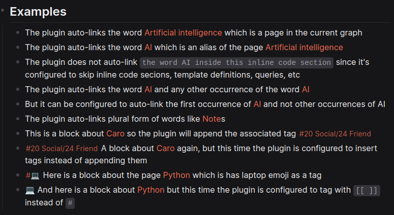

# Auto-link Auto-tag Plugin for Logseq
  

A Logseq plugin to auto-link pages in a block and auto-tag the block with the tags of the linked pages.

## Why this plugin
I use tags to represent categories e.g. #[[10 Health/12 Medicine]], #[[20 Social/24 Friend]],... and try to categorize notes to make them findable in case I ever forget the exact words used to write them.

Doing this manually is burdensome and inconsistent thus the wish to have a plugin that automates this process.

At first, I thought I just need to develop an automatic tagger plugin and keep using the very useful automatic linker plugin. Then, I realized I need to develop a plugin that auto-links and auto-tags __consecutively__ which is not guaranteed with the two plugins solution

## Features
- Auto-link pages and aliases
- Auto-tag blocks with the tags of linked pages and aliases
- Run by pressing enter
- Run by the slash command `Auto-link Auto-tag`
- Run by a keybinding `Ctrl+Shift+b` (configurable)
- Option: Auto-link all occurrences / only the first occurrence of a page
- Option: insert / append tags
- Option: Auto-tag with `[[tag]]` / `#tag`
- Option: Exclude page names from auto-linking
- Option: Exclude blocks from processing e.g. `.*::`.
- Option: Exclude any text pattern from processing e.g. `{{.*}}`
- Option: Auto-link plural form of pages e.g. `Mangos` -> `[[Mango]]s`

